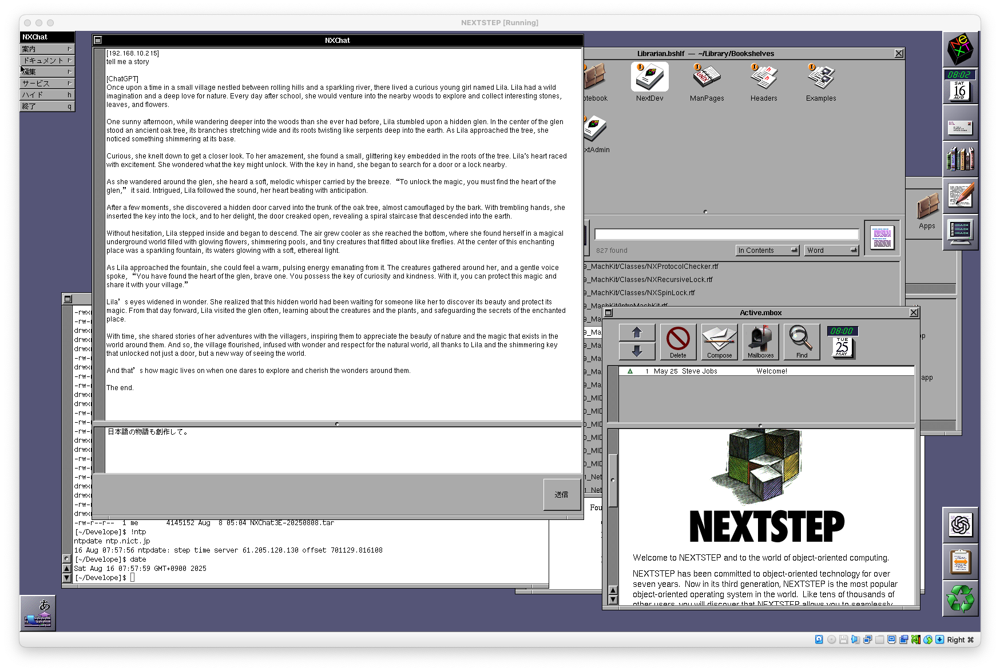

# NXChat
A minimal ChatGPT interface developed for NEXTSTEP 3.3.

Since it's difficult for legacy operating systems like NEXTSTEP to connect directly to services like OpenAI, this project provides a simple relay server and client setup that enables API access to ChatGPT and similar models.

Running an AI assistant on an operating system from the 1990s may evoke the feeling of what "the near future" once meant.

## Overview
NXChat consists of:
- A Python-based relay server
- A NEXTSTEP 3.3 native client application (NXChat)

## Server
The server (tcp_llm_broadcast_server.py) is a lightweight Python script, with most of its code generated by ChatGPT itself.

### To use it:

Set your OpenAI API key via the OPENAI_API_KEY environment variable.

Add the IP address of the NEXTSTEP client to the ALLOWED_IPS tuple in the script.

Run the server.

The server listens for TCP connections, forwards incoming prompts to ChatGPT, and returns the response along with the original prompt to the client. The code is simple and easy to adapt for other purposes with some basic programming knowledge.

## Client

### To build the client:

Copy the contents of the NXChat directory to your NEXTSTEP system.

Compile the project to produce NXChat.app.

Launch NXChat.app, open Info/Preferences, and enter the IP address of the server. Quit the app to save settings.

On the next launch, the settings will take effect.

### To use:

Type a prompt in the lower panel of the window.

Prompts that begin with /system are interpreted as system prompts, which cause the server-side chat history to be reset.

Click the Send button or press Command + Return.

After a short wait, the response from the server will appear in the upper panel.

You can also save the chat history to a file.

## Notes
This software is experimental and not guaranteed to work reliably.

It was developed on the Japanese version of NEXTSTEP 3.3 (NEXTSTEP3.3J), so some adjustments may be needed to build it on other language environments.

Multibyte characters (UTF-8) sent from the server are converted to Japanese EUC-JP encoding on the client side. If a corresponding character cannot be found during conversion, a space character is used as a fallback.

## Acknowledgments
Special thanks to Julie Zelenski for the EmacsText.h and EmacsText.m code, which enables Emacs-style key bindings in the prompt input area.

